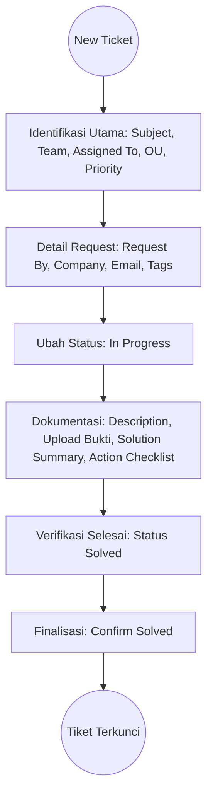

# IT-KLB-HELP-0001: Pengelolaan Tiket Helpdesk

## 1. INFORMASI DOKUMEN

- **Nama Perusahaan**: PT KREASI ARDUO INDONESIA
- **Nomor Dokumen**: IT-KLB-HELP-0001
- **Judul Dokumen**: Pengelolaan Tiket Helpdesk (_Helpdesk Ticket Management_)
- **Revisi**: 00
- **Tanggal Efektif**: 2026-02-10

---

## 2. TUJUAN (_Objective_)

Menstandarisasi proses pencatatan dan penanganan tiket bantuan IT di lingkungan Artugo melalui sistem Odoo agar setiap kendala teknis terdokumentasi dengan lengkap untuk kebutuhan audit dan basis data pengetahuan di masa mendatang, serta menjamin ketepatan pelaporan SLA (_Service Level Agreement_).

## 3. RUANG LINGKUP (_Scope_)

Prosedur ini berlaku untuk seluruh tim IT yang bertugas menangani permintaan bantuan teknis, meliputi pengelolaan tiket untuk entitas perusahaan di bawah Artugo (KAI, API, ACI), dan mencakup seluruh siklus tiket mulai dari status **New** hingga **Solved/Closed**.

## 4. REFERENSI (_Reference_)

- Modul Helpdesk Odoo.
- Kebijakan Keamanan Informasi IT Artugo.
- Manual User Antarmuka Odoo.

## 5. DEFINISI (_Definition_)

- **SLA**: _Service Level Agreement_ (Target waktu respon dan penyelesaian).
- **OU**: _Operating Unit_ (Satuan unit operasional tempat kejadian perkara).
- **Assigned To**: Personil IT yang ditunjuk sebagai penanggung jawab penyelesaian tiket.

## 6. TANGGUNG JAWAB (_Responsibility_)

- **IT Support/Helpdesk**: Melakukan input data tiket, menjalankan tindakan perbaikan, dan mengisi dokumentasi solusi teknis secara mendalam.
- **IT Manager/Team Lead**: Memvalidasi solusi yang diberikan teknisi dan memantau status tiket agar tidak melewati batas waktu SLA.
- **User/Requestor**: Memberikan deskripsi kendala yang jelas saat pelaporan dan melakukan verifikasi hasil pekerjaan sebelum tiket ditutup.

---

## 7. PROSEDUR TAHAPAN (_Step-by-Step_)

### 7.1 Pembuatan Tiket dan Identifikasi Utama

1. **Input Judul**: Masukkan kendala pada kolom **Subject** dengan format kategori dan deskripsi singkat.
2. **Helpdesk Team**: Tentukan tim yang relevan, secara standar menggunakan tim **Customer Care**.
3. **Assigned to**: Pilih nama teknisi yang bertugas pada kolom **Assigned to**.
4. **Operating Unit**: Pilih unit kerja terkait pada kolom **Operating Unit**.
5. **Priority**: Berikan peringkat urgensi pada kolom **Priority** dengan memilih jumlah bintang yang sesuai.

### 7.2 Pengisian Detail Request Info

1. **Request By**: Pilih nama personil pelapor pada kolom **Request By**.
2. **Company (PT)**: Pilih identitas perusahaan (KAI, API, atau ACI) pada kolom **Company (PT)**.
3. **Customer Email**: Pastikan alamat **Customer Email** sudah terverifikasi untuk pengiriman notifikasi otomatis.
4. **Ticket Type & Tags**: Tentukan **Ticket Type** dan tambahkan label kategori pada kolom **Tags** (_Optional_).

### 7.3 Pelaksanaan dan Dokumentasi Solusi

1. **Status In Progress**: Ubah status tiket menjadi **In Progress** saat tindakan perbaikan dimulai.
2. **Description**: Jabarkan kronologi masalah secara mendetail pada kotak **Description**.
3. **Upload Bukti**: Unggah bukti pendukung atau _Screenshot_ error melalui tombol **Upload Bukti**.
4. **Solution Summary**: Masukkan ringkasan hasil akhir perbaikan pada kolom **Solution Summary**.
5. **Action Checklist**: Tuliskan urutan tindakan teknis yang telah diambil pada kolom **Action Checklist**.

### 7.4 Finalisasi dan Penutupan Tiket

1. **Pelacakan Waktu**: Pastikan semua kolom pelacakan waktu (Tanggal Dibuat, Mulai, Selesai) telah terisi secara sistem.
2. **Status Solved**: Ubah status menjadi **Solved** jika perbaikan telah selesai dan diverifikasi oleh pemohon.
3. **Confirm Solved**: Klik tombol **Confirm Solved** untuk mengunci dokumen tiket secara permanen di dalam sistem.

---

## 8. PENANGANAN MASALAH (_Troubleshooting_) / Q&A

- **Tanya**: Bagaimana jika nama perusahaan tidak muncul di pilihan Company?
  - **Jawab**: Periksa kembali hak akses akun Odoo Anda, pastikan Administrator telah memberikan akses _Multi-company_.
- **Tanya**: Status tiket tidak bisa berubah menjadi In Progress.
  - **Jawab**: Pastikan kolom **Assigned to** tidak kosong dan dokumen telah disimpan (_Save_) terlebih dahulu.
- **Tanya**: Apakah boleh mengosongkan kolom Solution Summary?
  - **Jawab**: Tidak boleh, kolom ini wajib diisi sebagai bagian dari histori perbaikan untuk keperluan audit IT.

---

## 9. ALUR PROSES (_Flowchart_)

